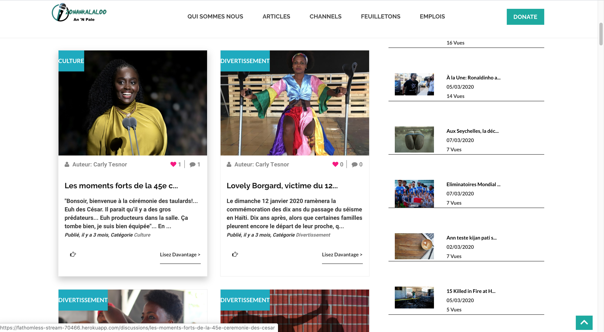

# ZonankalalooAppR

# Table of Contents

- [ZonankalalooAppR](#zonankalalooappr)
  * [Screenshots](#screenshots)
  * [Description](#description)
  * [Requirements](#requirements)
  * [Usage](#usage)
  * [Demo](#demo)
  * [Test](#test)


## Screenshots


## Description

This is a personal News App, built using  Ruby on Rails, HTML and CSS, SASS, Javascript Babel, rubocop, yarn, Postgres, AWS, Redis, and some gems. 

This is a news app where users can view existing articles with no need to sign up or log in. However, if a user would like to publish, like, or comment an article (news), s/he will need to register or sign in if s/he already has an account registered. A user is a constraint to edit/delete an article that is not his/hers. This app also provides a section where users can write a series. A User cannot edit/delete a series that is not his/hers. However, all users can view his/her series.

This app could have already been deployed on a professional hosting area which would make it accessible to the world, but due to some personal issues and some minor bugs to fix, we have not done so.

## Requirements

For development, you will need Node.js and a Ruby version and Postgres installed


## Usage

- Clone the repo and enter the project folder
```
git clone https://github.com/CornetS28/ZonankalalooAppR 
cd ZonankalalooAppR 
```
- Install dependencies: ```yarn install```
- Install dependencies: ```bundle install```
  
  (You may have to remove the `Gemfile.lock` and `Yarn.lock` files if encountering issues and then run ```bundle install``` and  ```yarn install```)
- Make sure you have Ruby installed
- Run:
    ```
      rails server 
    ```
 
 ## Demo
 If you want to view the live version of this app, copy and paste the following link in your browser: 
 
  [ZonanKalaloo Demo](https://fathomless-stream-70466.herokuapp.com/)
  
## Test
No Test has been written yet for this project. This will come soon.
